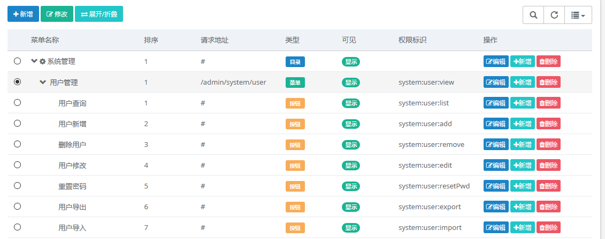

菜单最大允许三级菜单，这已经能够满足绝大多数的需求了。

菜单的渲染依赖于`Thymeleaf`模板引擎与`JQuery`的`metisMenu`插件。此外，关于封装的插件相关的UI方法统一放在`/resources/static/fun/js/fun-ui.js`，关于样式的 JS 文件是当前目录的`index.js`，通用的方法放在 `common.js` 中。

### 快速使用菜单管理

这里主要将如何使用这个功能来快速开发。在你项目的开始都是需要从这个新建菜单开始。其实你如果项目运行起来后，打开菜单管理一看都能看出本项目是如何将权限做到菜单级别的，如下图：

当你在新建菜单的时候，也需要按照这个规则来创建模块和菜单以及菜单中的按钮。

### 项目结束后，如何处理“多余”的菜单

首先，这是一个按钮级别的权限管理系统，建议新增一个账号分配给该用户一个新的角色，将期望该用户获得的功能分配相应的权限即可。

这些菜单并不多余，作为一个权限管理系统这些都是最基本的功能模块，无论是维护，还是扩展，都是需要的。如果你非常不需要这些功能，可在将其代码从项目中一一删除。

