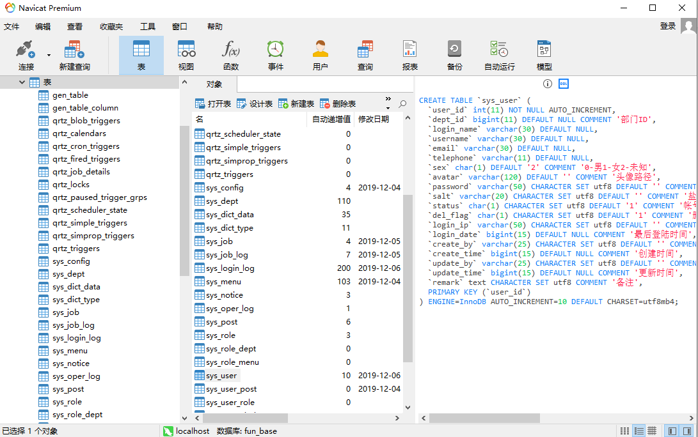

App的接口写法和Admin的写法略有不同，App端的Controller层统一使用`@RestController`注解，因为不涉及页面的跳转，`@Log`在App端使用，也需要传递一个枚举参数`LoginType.App`来标识当前是App的日志记录。

当前的代码生成工具是使用`freemarker`依赖开发的：

**Maven Freemarker**

```xml
<dependency>
  <groupId>org.springframework.boot</groupId>
  <artifactId>spring-boot-starter-freemarker</artifactId>
</dependency>
```

根据表的`SQL`来生成的，只需要提供`SQL`语句即可生成当前表的增删改查，不需要操作其它数据表。如果你使用的是`Navicat`，可以一键获取DDL，如下图：



将DDL复制到代码生成工具的输入框，点击生成代码。

当前单独版本的代码生成工具，欢迎 Star，[🤞直通车。](https://github.com/mrdjun/fun-generator)


