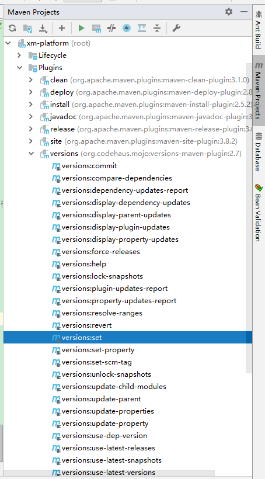

随着子项目日渐增多，版本号一个个子模块修改非常麻烦，可使用插件versions-maven-plugin解决。

**使用方式**
在主项目的pom中放入如下插件：

```html
<plugin>
    <groupId>org.codehaus.mojo</groupId>
    <artifactId>versions-maven-plugin</artifactId>
    <version>2.7</version>
    <configuration>
        <generateBackupPoms>false</generateBackupPoms>
        <processAllModules>true</processAllModules>
        <newVersion>1.0.5</newVersion>
    </configuration>
</plugin>
```

configuration含义如下：

generateBackupPoms：是否备份pom文件，一般为否

processAllModules：是否将版本号应用到所有项目，包括子项目，肯定是

newVersion：需要设置的新的版本号


其他更多更详细的参数可访问：http://www.mojohaus.org/versions-maven-plugin/set-mojo.html


**在idea中的使用**

在idea的Maven Projects中找到根项目，打开“Plugins”节点->“versions”节点，然后双击“versions:set”即可


