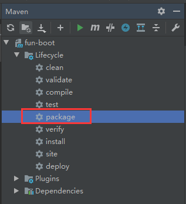
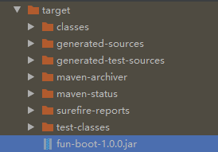
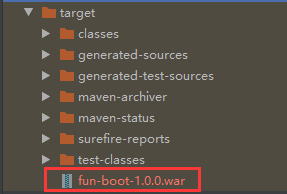

系统部署方式分为jar包部署，docker部署和war包部署。

## Jar包部署

运行maven的package命令，将项目打包成jar包：





Linux下部署jar包主要依赖于Linux的`nohup`命令。`nohup`命令可以将程序以忽略挂起信号的方式运行起来，被运行的程序的输出信息将不会显示到终端。

`nohup`语法：

```bash
nohup 命令
用途：不挂断地运行命令。
语法：nohup Command [ Arg … ][ & ]
```

所以只需要在启动命令前加上`nohup`命令，末尾加上`&`即可：`nohup java -jar XX.jar &`。

为了方便，我们可以编写启动脚本**start.sh**：

```bash
nohup java -jar XX.jar &
```

关停脚本**stop.sh**：

```bash
PID=`ps -ef | grep sms-2.0.jar | grep -v grep | awk '{print $2}'`
if [ -z "$PID" ]
then
    echo Application is already stopped
else
    echo kill $PID
    kill -9 $PID
fi
```

重启脚本**run.sh**：

```bash
echo stop application
source stop.sh
echo start application
source start.sh
```

在编写shell脚本的过程中遇到了两个问题：

1、执行`.sh`文件提示权限不足：

解决办法：执行命令`chmod u+x XX.sh`赋予当前用于可执行的权限即可。

2、提示/bin/bash^M: bad interpreter: 没有那个文件或目录。

问题出现的原因是shell脚本是在windows中编写的然后上传到Linux中的，出现了兼容性问题。解决办法：执行`vim XX.sh`打开shell文件，然后切换到命令模式，执行`:set fileformat=unix`后保存退出即可。

使用了`nohup`命令后，会在jar文件目录下生成一个nohup.out文件，可通过其观察当前项目的运行情况。

编写完shell脚本之后，便可执行`start.sh`，启动项目，执行`stop.sh`关停项目或者执行`run.sh`直接重启项目。

## war包部署

传统的war包部署方法：

在pom.xml文件中，将打包方式改为war：

```xml
<packaging>war</packaging>
```

然后添加如下的Tomcat依赖配置，覆盖Spring Boot自带的Tomcat依赖：

```xml
<dependency>
    <groupId>org.springframework.boot</groupId>
    <artifactId>spring-boot-starter-tomcat</artifactId>
    <scope>provided</scope>
</dependency>
```

即可通过 maven package 将项目打包成一个 war 包



将 war 包放入 tomcat 服务器中，重启一次 tomcat 即可。

## docker部署

敬请期待！


