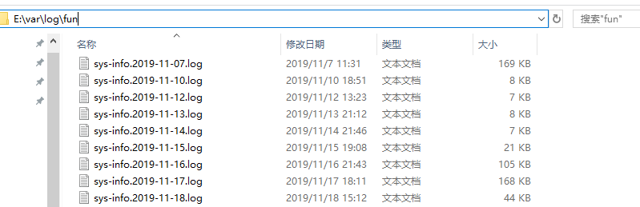

关于日志方面，我不得不说一下该项目的处理方式，日志有运行日志、登录日志、操作日志三个，在登录和操作的日志记录上是使用线程池另外开启线程将日志数据异步插入数据库，有些star超过了3.8k的脚手架，在登录成功时更新最后一次登录的时间和IP仍是采用的单线程。

### 运行日志配置

若为 Linux 系统，输出的日志文件保存在 /var/log/fun 中；若为 Windows 系统，则日志输出文件地址在当前盘符的根目录，如下图：



日志框架采用Spring Boot默认的logbak，具体配置见logback.xml。该配置主要配置了项目分别输出USER（目前项目配置项中的是用户登录的日志输出）和INFO以及ERROR级别的日志到日志文件，并且以天为单位保存，最多保存60天：

```xml
.........

    <!-- 系统日志输出 -->
    <appender name="file_info" class="ch.qos.logback.core.rolling.RollingFileAppender">
        <file>${log.path}/sys-info.log</file>
        <!-- 循环政策：基于时间创建日志文件 -->
        <rollingPolicy class="ch.qos.logback.core.rolling.TimeBasedRollingPolicy">
            <!-- 日志文件名格式 -->
            <fileNamePattern>${log.path}/sys-info.%d{yyyy-MM-dd}.log</fileNamePattern>
            <!-- 日志最大的历史 60天 -->
            <maxHistory>60</maxHistory>
        </rollingPolicy>
        <encoder>
            <pattern>${log.pattern}</pattern>
        </encoder>
        <filter class="ch.qos.logback.classic.filter.LevelFilter">
            <!-- 过滤的级别 -->
            <level>INFO</level>
            <!-- 匹配时的操作：接收（记录） -->
            <onMatch>ACCEPT</onMatch>
            <!-- 不匹配时的操作：拒绝（不记录） -->
            <onMismatch>DENY</onMismatch>
        </filter>
    </appender>

    <appender name="file_error" class="ch.qos.logback.core.rolling.RollingFileAppender">
        <file>${log.path}/sys-error.log</file>
        <!-- 循环政策：基于时间创建日志文件 -->
        <rollingPolicy class="ch.qos.logback.core.rolling.TimeBasedRollingPolicy">
            <!-- 日志文件名格式 -->
            <fileNamePattern>${log.path}/sys-error.%d{yyyy-MM-dd}.log</fileNamePattern>
            <!-- 日志最大的历史 60天 -->
            <maxHistory>60</maxHistory>
        </rollingPolicy>
        <encoder>
            <pattern>${log.pattern}</pattern>
        </encoder>
        <filter class="ch.qos.logback.classic.filter.LevelFilter">
            <!-- 过滤的级别 -->
            <level>ERROR</level>
            <!-- 匹配时的操作：接收（记录） -->
            <onMatch>ACCEPT</onMatch>
            <!-- 不匹配时的操作：拒绝（不记录） -->
            <onMismatch>DENY</onMismatch>
        </filter>
    </appender>

    <!-- 用户访问日志输出  -->
    <appender name="sys-user" class="ch.qos.logback.core.rolling.RollingFileAppender">
        <file>${log.path}/sys-user.log</file>
        <rollingPolicy class="ch.qos.logback.core.rolling.TimeBasedRollingPolicy">
            <!-- 按天回滚 daily -->
            <fileNamePattern>${log.path}/sys-user.%d{yyyy-MM-dd}.log</fileNamePattern>
            <!-- 日志最大的历史 60天 -->
            <maxHistory>60</maxHistory>
        </rollingPolicy>
        <encoder>
            <pattern>${log.pattern}</pattern>
        </encoder>
    </appender>

 .........
```

##### 配置日志文件的输出位置

```xml
<property name="log.path" value="/var/log/fun" />
```

##### 配置日志输出格式

项目中提供了两种日志格式：彩色与黑白，均包含了时间，路径和线程等信息。。若需改为黑白，将log.colorPattern 改为 log.pattern。若不能满足你的需求，修改格式即可。

```xml
   <appender name="console" class="ch.qos.logback.core.ConsoleAppender">
        <encoder>
            <pattern>${log.colorPattern}</pattern>
        </encoder>
    </appender>
```

此外，在 application-dev.yml 中有下面这段配置：

```yaml
logging:
  level:
    com.fun: debug
    org.springframework: warn
```

级别为debug后，当前包下的增删改查的操作SQL都会被打印在控制台中，作为开发者模式还是很有必要的。

### 操作日志

项目中用户的操作日志，追踪操作方法、参数、操作IP、地点、时间等，该功能是依赖于AOP实现的。切点为`@Log`注解：

```java
@Target({ElementType.PARAMETER, ElementType.METHOD})
@Retention(RetentionPolicy.RUNTIME)
public @interface Log {
    /**  操作名称 */
    String value() default "";

    /** 默认为后端 */
    LoginType type() default LoginType.admin;

    /**  是否保存请求的参数 */
    boolean isSaveRequestData() default true;
}
```

项目的App端和Admin端都共用此注解记录用户的操作日志，故使用枚举LoginType做区分作用：

```java
public enum LoginType {
    /**  App端 */
    App("0","app"),
    /** admin端 */
    admin("1","admin");

    private final String code;
    private final String info;

    LoginType(String code,String info){
        this.code = code;
        this.info = info;
    }
}
```

**使用方法**

在 Service层 或 Controller层的方法上加上 `@Log`注解即可，如：

```java
    @Log("新增项目配置")

    @PostMapping("/add")
    @ResponseBody
    public CommonResult insertConfig(@Validated Config config) {
        if (Constants.NOT_UNIQUE.equals(configService.checkConfigKeyUnique(config))) {
            return failed("新增参数'" + config.getConfigName() + "'失败，参数键名已存在");
        }
        return success(configService.insertConfig(config));
    }
```

这样在修改项目配置信息的时候，便会记录下用户的操作信息等。


**关闭操作日志记录**

如果你不需要这个功能，可以在 fun-boot.properties 中 将 fun.operLog 的值改为 false 即可。


