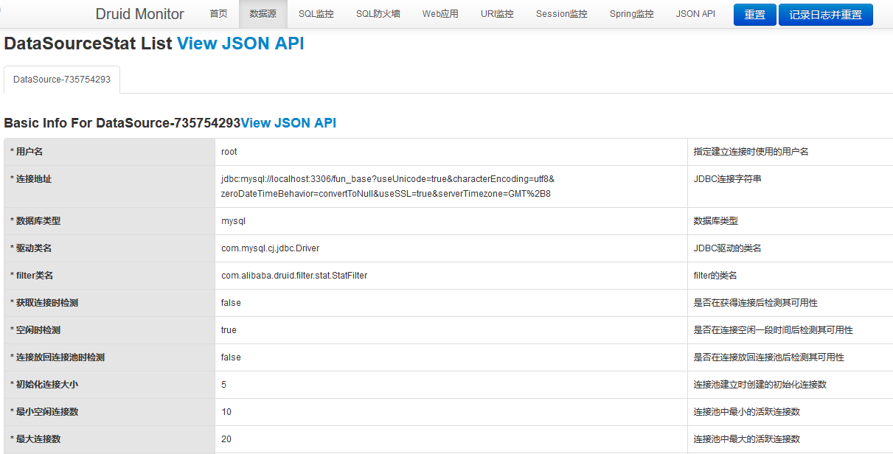
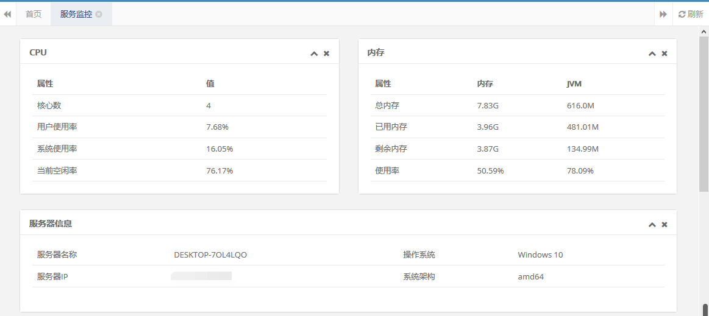

### 📺Druid数据监控

Druid 是阿里的一个数据库连接池的开源项目，提供性能卓越的连接池功能外，还集成了SQL监控，黑名单拦截等功能，强大的监控特性，通过Druid提供的监控功能，可以清楚知道连接池和SQL的工作情况。地址：https://github.com/alibaba/druid

在本项目中关于Druid 的配置项：

```bash
spring:
  datasource:
    type: com.alibaba.druid.pool.DruidDataSource
    driverClassName: com.mysql.cj.jdbc.Driver
    druid:
      # 主库数据源
      master:
        url: jdbc:mysql://localhost:3306/fun_base?useUnicode=true&characterEncoding=utf8&zeroDateTimeBehavior=convertToNull&useSSL=true&serverTimezone=GMT%2B8
        username: root
        password: root
      # 从库数据源
      slave:
        # 从数据源开关/默认关闭
        enabled: false
        url:
        username:
        password:
      # 初始连接数
      initialSize: 5
      # 最小连接池数量
      minIdle: 10
      # 最大连接池数量
      maxActive: 20
      # 配置获取连接等待超时的时间
      maxWait: 60000
      # 配置间隔多久才进行一次检测，检测需要关闭的空闲连接，单位是毫秒
      timeBetweenEvictionRunsMillis: 60000
      # 配置一个连接在池中最小生存的时间，单位是毫秒
      minEvictableIdleTimeMillis: 300000
      # 配置一个连接在池中最大生存的时间，单位是毫秒
      maxEvictableIdleTimeMillis: 900000
      # 配置检测连接是否有效
      validationQuery: SELECT 1 FROM DUAL
      testWhileIdle: true
      testOnBorrow: false
      testOnReturn: false
      webStatFilter:
        enabled: true
      statViewServlet:
        enabled: true
        # 设置白名单，不填则允许所有访问
        allow:
        url-pattern: /druid/*
        # 控制台管理用户名和密码
        login-username: admin
        login-password: admin
      filter:
        stat:
          enabled: true
          # 慢SQL记录
          log-slow-sql: true
          slow-sql-millis: 1000
          merge-sql: true
        wall:
          config:
            multi-statement-allow: true
```



因考虑到生产环境至少有一个从库，故在项目中开发了数据源切换功能。具体功能描述[点击此处跳转](generic/datasource.md)。

### 📺服务器监控

在项目中该功能主要依赖 oshi 来获取服务器相关信息，通过 JDK 提供的 ManagementFactory 获取JVM相关信息。Maven 依赖如下：

```xml
<dependency>
   <groupId>com.github.oshi</groupId>

   <artifactId>oshi-core</artifactId>

   <version>3.9.1</version>

</dependency>
```

主要获取服务器的CPU信息、内存信息等。



### 📺Redis 监控

该功能主要获取 Redis 的信息以及内存消耗、key的生命周期的信息。    


