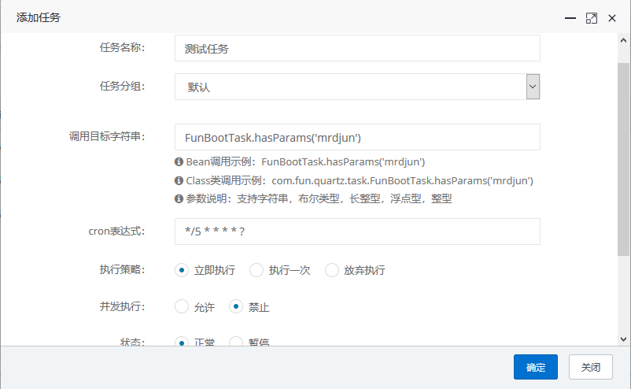
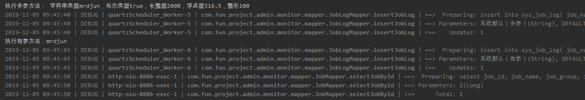
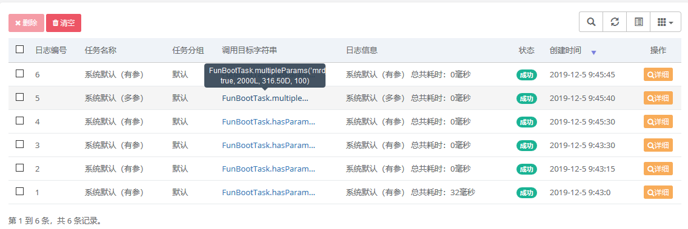

任务调度根据存储的方式可以分为内存模式和数据库模式。本项目使用的是数据库模式。前面在导入数据表的时候也提到了，因为使用的是 quartz 依赖，所以qrtz_开头的数据表就是用于维护任务调度使用的。

```xml
        <dependency>
            <groupId>org.quartz-scheduler</groupId>
            <artifactId>quartz</artifactId>
            <exclusions>
                <exclusion>
                    <groupId>com.mchange</groupId>
                    <artifactId>c3p0</artifactId>
                </exclusion>
            </exclusions>
        </dependency>
```

在本脚手架中，创建一个任务很简单，可以在项目的任何一个能被Spring 上下文扫描到的路径，创建一个任务类，然后写需要执行的方法，如：

```java
@Component("FunBootTask")
public class FunBootTask {
    public void hasParams(String params) {
        System.out.println("执行有参方法：" + params);
    }
}
```

然后在后台的系统监控 -> 任务调度，新增任务时执行策略选择立即执行，点击确定，即可开启当前任务。



参数说明：

- Bean调用的名称对应如 @Component("funboot") 中的 'funboot';

-  Class的调用从包名到类中的方法名，传入参数执行;

- 方法参数指定了方法`hasParams(String params)`参数`params`的值为mrdjun；

- cron表达式用于指定任务调度的规则，上图中的cron表达式表示每隔5秒触发一次；

- 备注用于简单描述该调度方法的作用。

下面是 hasPerms 在控制台输出的一些内容以及调度任务日志的记录：





对Cron表达式不是很明确的朋友，可以使用在线生成工具：http://cron.qqe2.com/


