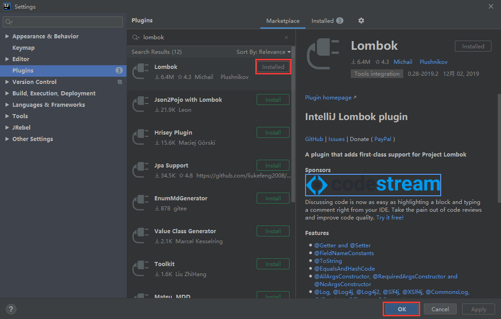
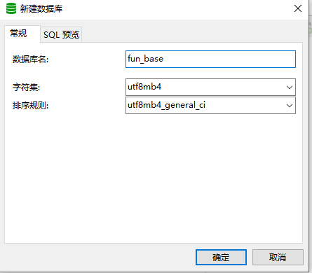
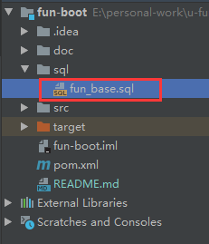
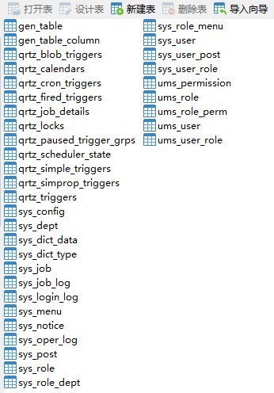
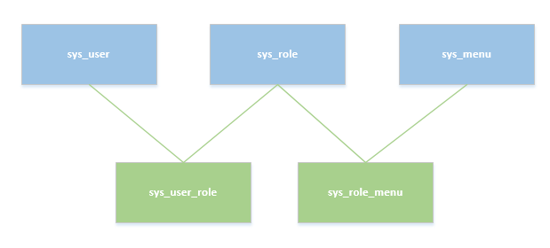

### 项目下载

#### 下载姿势一：

在GitHub上的项目仓库，点击Clone or download 即可下载，在下载的时候，不要忘了顺手给项目点个 <span style="color:red;font-size:22px"> star </span> 哦~

#### 下载姿势二：

安装了Git 的朋友，可以直接命令下载

```git
git clone https://github.com/mrdjun/fun-boot.git
```

### 项目导入

IDE工具选择Eclipse或者Intellij IDEA均可。导入项目后，IDE需要 **安装 lombok 插件**。IDEA 安装方式如下图：



### 创建数据库

使用SQL命令创建数据库：

```sql
CREATE DATABASE `fun_base` CHARACTER SET 'utf8mb4' COLLATE 'utf8mb4_general_ci';
```

    使用 Navicat 创建数据库：



### 导入数据库

直接复制执行项目中的SQL即可：



如果数据库版本不是5.7的在执行SQL文件的时候会报错，这时候只需要根据报错信息简单修改SQL语句，然后重新执行即可。



对于App和Admin用户与权限之间的关系，使用的是经典的RBAC（**R**ole-**B**ased **A**ccess **C**ontrol，基于角色的访问控制）模型。简单的来说，在Admin端，一个用户具备拥有若干角色，每一个角色拥有若干权限菜单。这样，就构造成“用户-角色-权限”的授权模型。在这种模型中，用户与角色之间，角色与权限之间，一般者是多对多的关系。如下图所示：



在本项目的 sys_menu 的表采用的是无限级分类的设计，权限相关的信息位于perms字段中，这样就能非常直观的把权限精确的分配到按钮，所以没有单独拆分出权限的这个必要。

qrtz_开头的表用于维护任务调度，可以参考：[http://www.ibloger.net/article/2650.html](http://www.ibloger.net/article/2650.html)。

ums_（user manage system）开头的表是 app用户相关权限分配的表。

项目中数据库链接信息可在application-dev.yml中修改：

```yaml
spring:
  datasource:
    type: com.alibaba.druid.pool.DruidDataSource
    driverClassName: com.mysql.cj.jdbc.Driver
    druid:
      # 主库数据源
      master:
        url: jdbc:mysql://localhost:3306/fun_base?useUnicode=true&characterEncoding=utf8&zeroDateTimeBehavior=convertToNull&useSSL=true&serverTimezone=GMT%2B8
        username: root
        password: root
      # 从库数据源
      slave:
        # 从数据源开关/默认关闭
        enabled: false
        url:
        username:
        password:
```

### 启动项目

在完成上述步骤后，包括启动 Redis ，在项目的com.fun的包下找到FunBootApplication，右键点击启动，访问地址：localhost:8886 ，用户名：mrdjun，密码：123456。
